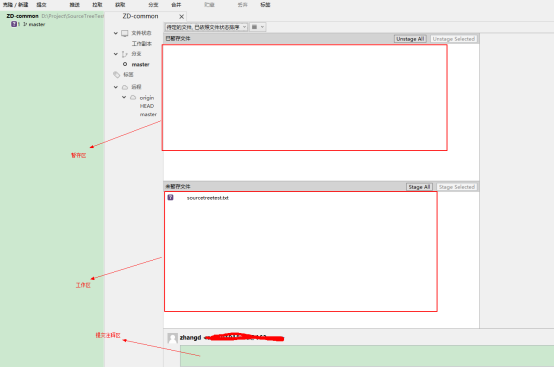
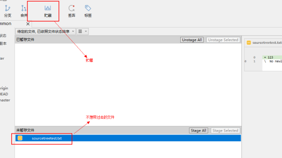
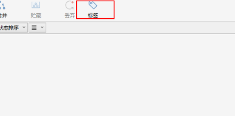
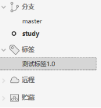
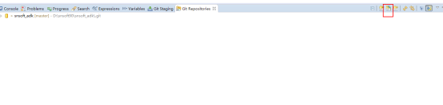
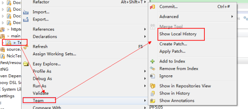
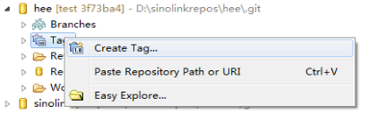
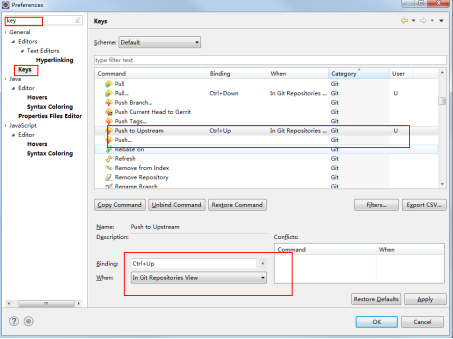

# Chapter 3. Git
**Git --everyting is local **

Git是一个分布式版本控制工具，它的主要特性在于：

* 区分本地仓库和远程仓库，每一处都是完整的独立副本。

  因此在操作上会区分commit（提交到本地仓库）和push（提交远程仓库）

* 基于branch和merge模型设计  
   Git官方鼓励我们建立本地branch，基于本地branch开发完成后合并至master。在push远程仓库时，只需要处理master即可，不需要将本地branch全部退给远程仓库。

* 体积小、性能高

* 分布式，每一处都是完整的代码副本

* 基于工作区操作

* 开源免费

Git官方有一个操作教程，有兴趣的同学可以体验一下shell方式的操作过程：[Try Git](https://try.github.io/)。

## 安装Git

在如下地址下载Git工具后安装：

[https://git-scm.com/downloads](https://git-scm.com/downloads)

或`ftp/software软件安装包/Git和Svn/Git/`

安装完成后，右键菜单中选择 Git Bash 生成ssh密钥（用于同远程仓库验证）

在shell中输入：

```
ssh-keygen -t rsa -C "你的名字@snsoft.com.cn"
```

注意需要将命令中的邮箱替换为你的邮箱，执行完成后会在你的Windows用户文件夹下生成`.ssh`文件夹。里面是公钥和私钥文件如下：

```
id_rsa
id_rsa.pub
```

同时需要将公司提供的`known_hosts` 文件和`config` 文件拷贝到`.ssh` 文件夹下。

config文件内容：

```
Host "sino"
HostName "git.sino-clink.com.cn"
User "git"
IdentityFile "~/.ssh/sino_rsa"

Host "snsoftadk"
HostName "adk-git.sino-clink.com.cn"
User "git"
IdentityFile "~/.ssh/sino_rsa"
```

可以看到，config文件中用于标识身份验证的文件名为 `sinorsa`，因此需要将刚刚生成的两个密钥文件改为`sino_rsa,sino_rsa.pub`

同时将公钥`sino_rsa.pub` 复制一份重命名为`你的名字@snsoft.com.cn.pub`，这个文件需要发送给相关人员开通权限。

## 安装Git GUI工具

在如下地址下载Git可视化工具安装：

[https://git-scm.com/downloads/guis](https://git-scm.com/downloads/guis)或公司FTP `ftp/software软件安装包/Git和Svn/Git/`

windows下Git可视化工具主要选择有以下几种：

* SourceTree
* TortoiseGit
* Eclipse插件

我们推荐使用SourceTree或者Eclipse自带插件。

### SourceTree设置

SoucreTree中菜单选择`工具-选项`

在选项中需要配置**用户全名、用户邮箱和SSH密钥文件路径。**

SSH客户端选择**OpenSSH**

> 注意：需要设置提交人员的简体名称

### SourceTree使用

首选要克隆一个远程仓库到本地。这里需要设置远程仓库的URL以及本地仓库的存放路径。

克隆完成后，你就得到了一个本地仓库。其中：

* 文件状态：展示本地文件修改清单

* 分支：展示本地仓库所有分支

* 远程：展示远程仓库所有分支

* 右侧列表则展示当前分支的操作日志

#### Pull（拉取）

将远程仓库代码拉取到本地仓库，这里有一个选项：

* [x] 立即提交合并的改动

需要勾选，该选项代表的是将远程仓库拉取到本地后，自动将远程仓库和本地仓库merge结果commit到本地仓库。

#### Commit（提交）

将代码修改提交至本地仓库。该操作在SourceTree文件状态页面进行。

文件状态页面分为 暂存区、工作区和提交注释区。如图：



所有未提交文件都会在工作区展示。

提交前，将需要提交的文件拖拽到暂存区，或者使用 Stage All（暂存所有），Stage Selected（暂存所选）按钮操作。

在注释区填入本次提交的注释选择提交按钮操作。

> 注意：在提交时，注释必须说明本次提交修改内容，因为提交只是针对本地仓库，并不影响远程仓库，我们鼓励开发同学进行提交操作，完成一块细分任务就可以提交。甚至可以新建分支进行开发任务，待完成后合并至主干。

#### Push（推送）

将本地仓库推送到远程仓库。在推送时，远程仓库会校验本次推送的版本号，因此在推送前，需要先拉取代码合并，保证本地仓库版本不能落后远程仓库。

#### 冲突解决

**场景1：**当你开发完成后想要提交（Commit）代码，然后直接推送到远程，这时候可能会因为其他开发人员已经在你最后一次拉取代码的那个版本之后向远程推送了好一个或多个版本了，此时你直接推送到远程会报错，提示你需要先拉取（Pull）代码，此时拉取一下代码在推送即可。

**场景2：**在基于场景1的情况下，当你和另外一个开发人员修改同一个代码文件的时候，另外一个开发人员已经将他的修改推送到远程，此时你拉取代码有可能会发生冲突。此时项目里的文件都会报红，需要你去对比拉下来的代码和你备份的代码的不同之处，然后修改再提交推送。

**场景3：**在提交（Commit）代码之前先拉取（Pull）代码，此时如果有冲突会在报错时提示给你都哪些文件冲突了，这时你也可以将冲突的文件备份，然后使用未暂存区的代码还原还原这些文件，再拉取（Pull）代码，这样可以避免冲突，但这时还是需要你去对比拉下来的代码和你备份的代码的不同之处，然后修改再提交推送。

#### 代码还原

**场景：**有时候修改了代码后发现修改的代码都是错的或者其他情况需要将文件还原到文件修改前的状态。此时选择工作区的要还原的文件右键丢弃即可还原到你本地仓库最新的版本。

#### 分支管理

假设你准备开发一个新功能，但是需要两周才能完成，第一周你写了50%的代码，如果立刻提交，由于代码还没写完，不完整的代码库会导致别人不能干活了。如果等代码全部写完再一次提交，又存在丢失每天进度的巨大风险。现在有了分支，就不用怕了。你创建了一个属于你自己的分支，别人看不到，还继续在原来的分支上正常工作，而你在自己的分支上干活，想提交就提交，直到开发完毕后，再一次性合并到原来的分支上，这样，既安全，又不影响别人工作。

##### 创建分支

点击分支按钮创建新的分支。如果你此时正在master分支上，那么这个新建的分支是以master分支为主干的一个分支。

创建完成后，在你的本地分支会出现你刚建的分支，此时是默认将代码合并过来的。

分支创建完成后你就可以按照正常的拉取（Pull）提交（Commit）和推送（Push）进行开发了。但是需要注意的是，**如果新建的分支只是用于自己本地开发代码测试，并不会与其他人共享这个分支，请不要有推送（Push）操作，否则会把这个分支推送到远程仓库，对整个管理会有影响**。

##### 分支切换

分支的切换比较简单，直接双击本地仓库的分支名即可。

##### 分支切换需要注意的地方

###### 未提交文件的暂存：

**场景：**在新分支开发完成后（或者需要临时切换到开发使用的主干分支），需要将新分支的代码合并到开发使用的主干分支上去，这时新分支上最好不要有未提交的代码，否则会在分支切换的时候将你未提交的东西都带到主干分支上去。如果有不需要提交的文件或代码，并且这些东西并不想带到主干分支上去需要进行贮藏操作。



选择贮藏操作后，会在中间的树形导航视图出现贮藏节点，节点中有你在本仓库暂存的东西，当你在切回新分支的时候，还需要这些暂存的文件的话，右键取出来即可。

###### 分支的合并：

这里在合并的时候需要注意方向。

首先切换到你要合并到（例如开发的主分支）的分支上去，选择要合并的分支（例如你的开发分支），右键选择合并xxx分支到当前分支。

###### 合并冲突解决：

**场景：**此时你在文件状态界面可以看到冲突的文件行，包括当前分支的版本，与合并分支的版本冲突的位置都有标记，如下图右侧，HEAD部分标识当前所在分支的代码，======标识下面的表示合并过来的分支的代码。


比较理想的情况是如果确定使用哪个分支版本的话就右键冲突文件解决冲选择使用我的（当前分支）版本或者他人（另外合并过来的分支）版本。

否则的话需要自己根据需要来修改冲的文件修改完成后，右键冲突文件解决冲标记为已解决，然后正常提交推送即可。

#### 标签管理

Eclipse发布一个版本时，我们通常先在版本库中打一个标签（tag），这样，就唯一确定了打标签时刻的版本。将来无论什么时候，取某个标签的版本，就是把那个打标签的时刻的历史版本取出来。所以，标签也是版本库的一个快照。



### 自带插件

Eclipse插件主要使用两个视图 Git Staging 和 Git Repositories

* Git Staging：文件状态展示、Commit操作
* Git Repositories：仓库展示、Push操作

> 注意：需要设置提交人员的简体名称

#### 克隆远程仓库

Git Repositories视图中选择图中按钮，按照要求选择克隆的仓库分支即可：



#### Pull（拉取）

Git Repositories视图右键选择要拉取的仓库，选择Pull操作。

#### Commit（提交）

Git Staging视图中进行操作，该视图同SourceTree类似，也区分暂存区、工作区、提交注释区。

#### Push（推送）

Git Repositories视图右键选择要Push的仓库，选择Push to Upstream操作。

#### 冲突解决

**场景1：**当你开发完成后想要提交（Commit）代码，然后直接推送到远程，这时候可能会因为其他开发人员已经在你最后一次拉取代码的那个版本之后向远程推送了好一个或多个版本了，此时你直接推送到远程会报错，提示你需要先拉取（Pull）代码，此时拉取一下代码在推送即可。  
**场景2：**有时候忘了拉取\(Pull\)代码，直接提交\(Commit\)代码，再推送\(Push\)到远程仓库时会提示要先拉取\(Pull\)代码，但是在拉取\(Pull\)代码时会有冲突，此时工程中的冲突文件会报红，此时选择冲突文件，右键"team"，选择“merge tool”,打开的视图中可以查看到修改的对比。  
将每个冲突文件修改为正确的，然后进行commit步骤进行正常提交即可。  
**场景3：**在提交（Commit）代码之前先拉取（Pull）代码，此时如果有冲突会在报错时提示给你都哪些文件冲突了，这时你也可以将冲突的文件备份，然后使用4中的代码还原还原这些文件，再拉取（Pull）代码，这样可以避免冲突，但这时还是需要你去对比拉下来的代码和你备份的代码的不同之处，然后修改再提交推送。

#### 分支管理

##### 创建分支

Git Repositories视图中选择要创建新分支的本地库右键选择**Switch To --&gt; New Branch… **  
可以选择在哪个分支的基础上新建分支，输入新分支的名字，Finish后会切换到新建的分支。  
注意此时新创建的分支为本地分支，只在你本地存在，如果这个新分支需要多个开发共同使用，可以在提交\(Commit\)代码后进行Push操作将分支推送到远程仓库，其他人员可切换到此分支。  
需要注意的是，**如果新建的分支只是用于自己本地开发代码测试，并不会与其他人共享这个分支，请不要有推送（Push）操作，否则会把这个分支推送到远程仓库，对整个管理会有影响。**

##### 分支切换

当功能开发完毕后需要将当前分支的代码合并到开发的主分支上的时候，可以通过选择本地仓库右键选择**Switch To** 选择你要切换的分支。注意切换前需要把你没有提交\(commit\)的代码进行暂存，否则在切换分支时会将这些没提交的代码带到另一个分支上。

##### 分支切换需要注意的地方

###### 未提交文件的暂存：

**场景：**在新分支开发完成后（或者需要临时切换到开发使用的主干分支），需要将新分支的代码合并到开发使用的主干分支上去，这时新分支上最好不要有未提交的代码，否则会在分支切换的时候将你未提交的东西都带到主干分支上去。如果有不需要提交的文件或代码，并且这些东西并不想带到主干分支上去需要进行贮藏操作。  
Git Repositories视图中右键选择要暂存的本地仓库，输入暂存的名字，确定此时会在仓库的目录里看到有一个Stashed Commits节点

里边有你暂存过的数据可以删除可以提取出来，这个暂存列表在各个分支上都是可见。  
选择要取出暂存数据的节点，右键**Apply Stashed Changes**取出暂存的数据到当前本地分支，如果暂存的数据不用了可以右键删除。

###### 分支的合并：

这里在合并的时候需要注意方向。

首先切换到你要合并到（例如开发的主分支）的分支上去，选择要合并的分支（例如你的开发分支），右键选择Merge。  
选择要合并数据的分支Merge。此时会发现仓库显示有需要推送到远程仓库的版本，Push到远程仓库即可

###### 合并冲突解决：

在合并分支的时候往往会遇到两个分支的同一个文件的同一行代码都被修改，导致合并的时候会发生冲突。在冲突的文件中Git会用&lt;&lt;&lt;&lt;&lt;&lt;&lt;，=======，&gt;&gt;&gt;&gt;&gt;&gt;&gt;标记出不同分支的内容。

我们根据代码本身来修改冲突位置的代码，修改完成测试通过后再提交。

#### 代码还原

每当你觉得文件修改到一定程度的时候，就可以“保存一个快照”，这个快照在Git中被称为commit。一旦你把文件改乱了，或者误删了文件，还可以从最近的一个commit恢复，然后继续工作，而不是把几个月的工作成果全部丢失。

##### 文件回退

选择要回退的文件右键，



可以选择你要恢复的版本

##### 多文件版本还原

界面Git Staging的工作区中会有你修改过的文件，此时选中你要还原的文件，右键Replace就可以将修改的文件还原到修改之前本地最新的版本。注意新加的文件\(带问号\)因为还不受Git版本控制，所以不存在还原一说。

#### 标签管理

Eclipse发布一个版本时，我们通常先在版本库中打一个标签（tag），这样，就唯一确定了打标签时刻的版本。将来无论什么时候，取某个标签的版本，就是把那个打标签的时刻的历史版本取出来。所以，标签也是版本库的一个快照。



#### 快捷键

在使用中，Pull代码和Push Upstream两种操作可以设置Eclipse快捷键：



